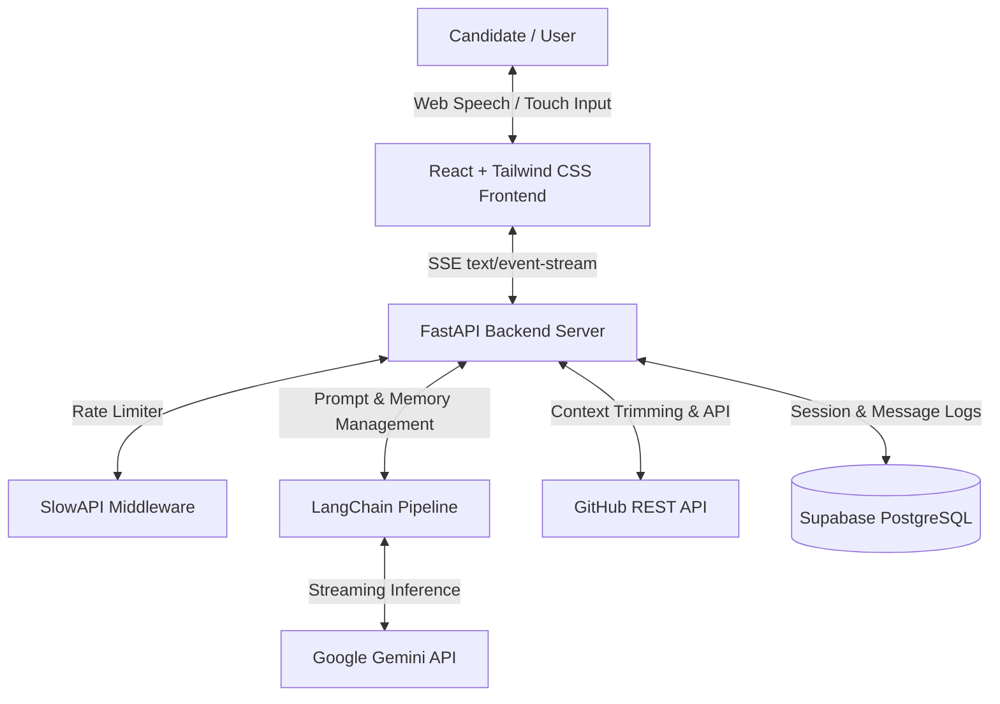
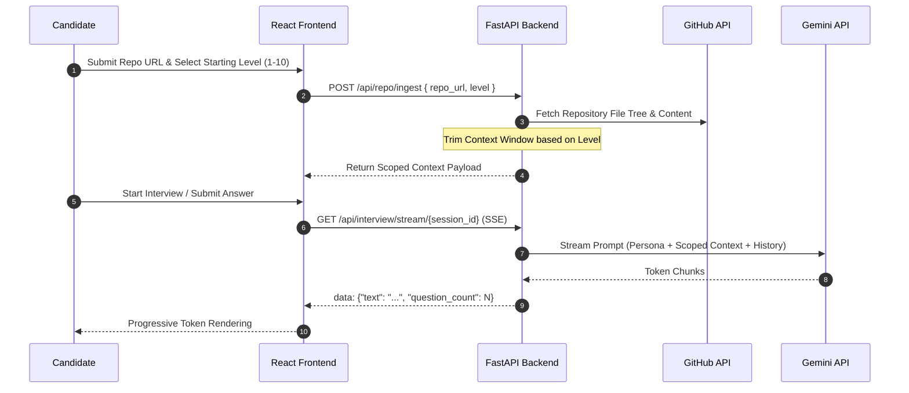

# RepoRoast

RepoRoast is a technical mock interview escalation platform designed to simulate realistic repository-focused coding interviews. It mirrors real-world hiring practices by starting with high-level architectural screening and escalating to line-by-line code reviews.

The architecture dynamically trims repository context passed to LLM context windows at lower difficulty levels, significantly reducing token consumption while maintaining low latency on 8GB host machines.

---

## System Architecture



---

## Escalation Pipeline & Context Trimming Strategy

To optimize token efficiency and mirror real technical interview progression:



| Difficulty Level | Interview Focus | Context Injected into Gemini Prompt |
| :--- | :--- | :--- |
| **Levels 1–3 (Screening)** | High-level vision, stack choice, domain | `README.md` and dependency manifests (`package.json`, `requirements.txt`, `pyproject.toml`, `go.mod`, `Cargo.toml`) |
| **Levels 4–7 (System Design)** | Security, data flow, architecture | `README.md`, directory file tree, and routing entrypoint files (`routes/`, `api/`, `main.py`, `app.py`) |
| **Levels 8–10 (Deep Code Review)** | Algorithmic efficiency, memory, edge cases | Complete filtered source code tree (excluding vendor, binaries, `.git`, `node_modules`) |

---

## Core Capabilities

- **Real-Time Token Streaming**: Built on FastAPI `StreamingResponse` emitting Server-Sent Events (`text/event-stream`) to browser `EventSource` subscribers for immediate progressive text rendering.
- **Interviewer Personas**: Supports selectable presets (**FAANG Gatekeeper**, **Startup CTO**, **Pedantic Security Auditor**, **Empathetic Mentor**) or custom injected system prompts.
- **Adaptive Pivots and Panic Button**: Includes hint request logic and a "Reveal Answer" panic override that forces the AI to explain technical concepts before transitioning to the next question.
- **Speech Input**: Integrates native browser Web Speech API (`SpeechRecognition` / `webkitSpeechRecognition`) for hands-free audio answers with live transcript display.
- **Comprehensive Scorecard**: Sessions are capped at 5 technical questions, concluding with an evaluation matrix covering Technical Depth, System Architecture, Communication Clarity, Problem Solving, and Code Quality.

---

## Repository Navigation

Detailed subsystem documentation is available in each respective directory:

- [Backend Documentation](file:///d:/RepoRoast/backend/README.md): API routes, request/response schemas, rate limiting, and test execution commands.
- [Frontend Documentation](file:///d:/RepoRoast/frontend/README.md): Component structure, state management, SSE streaming integration, and Web Speech API setup.
- [Database Schema](file:///d:/RepoRoast/supabase/schema.sql): Supabase PostgreSQL tables, constraints, and indexes.

---

## Prerequisites & Installation

### Prerequisites
- Python 3.10+
- Node.js 18+
- Git

### Backend Setup
```bash
cd backend
python -m venv venv
# On Windows: venv\Scripts\activate
pip install -r requirements.txt
cp .env.example .env
uvicorn app.main:app --reload --port 8000
```

### Frontend Setup
```bash
cd frontend
npm install
npm run dev
```

---

## Testing

Run the automated backend test suite using `pytest`:

```bash
python -m pytest backend/tests/
```

---

## License

MIT License
